  

  
  

I build intelligent software where **computer vision**, **biomedical imaging**, and
**human-centered tools** overlap. My work ranges from medical-image segmentation
and generative digital twins to local-first desktop environments for research and
creative work.

<table>
  <tr>
    <td>🔬 <strong>Building</strong></td>
    <td>Imaging systems that turn complex scans into useful measurements</td>
  </tr>
  <tr>
    <td>🧠 <strong>Exploring</strong></td>
    <td>3D vision, diffusion models, multimodal AI, and agent-native interfaces</td>
  </tr>
  <tr>
    <td>📍 <strong>Based in</strong></td>
    <td>San Francisco Bay Area</td>
  </tr>
</table>

## Selected work

<table>
  <tr>
    <td width="50%" valign="top">
      <h3>🫁 <a href="https://github.com/axel-slid/lung-pet-segmenter">Lung PET Segmenter</a></h3>
      
A private-first Electron workstation for TotalSegmentator CT labels and uptake-guided PET refinement.

      

        
        
        
      

    </td>
    <td width="50%" valign="top">
      <h3>🧬 <a href="https://github.com/axel-slid/cnf-flux2-digital-twin-replication">cNF Digital Twins</a></h3>
      
A data-free replication pipeline for geometry-guided cNF and postoperative-scar FLUX.2 adapters.

      

        
        
        
      

    </td>
  </tr>
  <tr>
    <td width="50%" valign="top">
      <h3>🖥️ <a href="https://github.com/axel-slid/agentdesk">AgentDesk</a></h3>
      
An agent-native desktop workspace for LaTeX papers, PDFs, terminals, and collaborative review workflows.

      

        
        
        
      

    </td>
    <td width="50%" valign="top">
      <h3>🎛️ <a href="https://github.com/axel-slid/rekordbox-history-viewer">Rekordbox History Viewer</a></h3>
      
A desktop app for exploring played-track history, sets, listening patterns, and library statistics.

      

        
        
        
      

    </td>
  </tr>
</table>

## Toolbox

  

## GitHub at a glance

  
  

## Contribution trail

<picture>
  <source media="(prefers-color-scheme: dark)" srcset="https://raw.githubusercontent.com/axel-slid/axel-slid/output/github-contribution-grid-snake-dark.svg" />
  <source media="(prefers-color-scheme: light)" srcset="https://raw.githubusercontent.com/axel-slid/axel-slid/output/github-contribution-grid-snake.svg" />
  
</picture>

  Good tools should make difficult work feel obvious.

